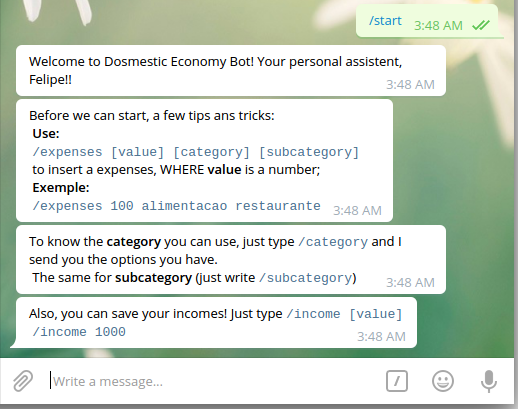
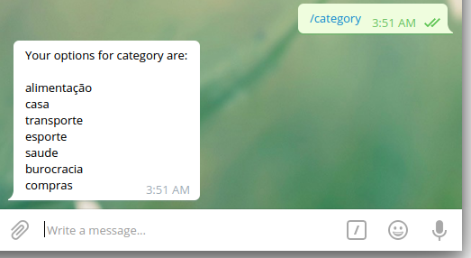
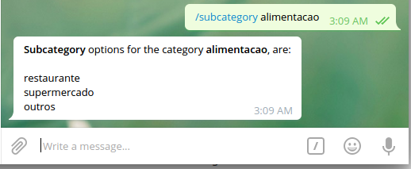
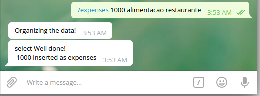
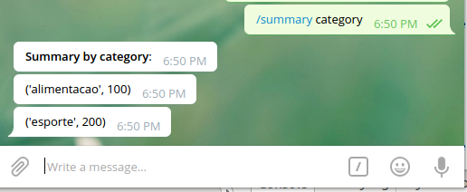
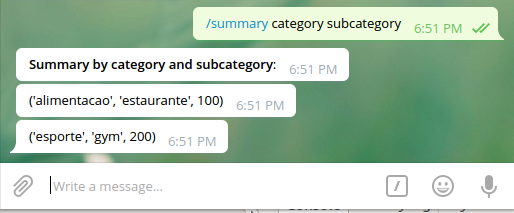
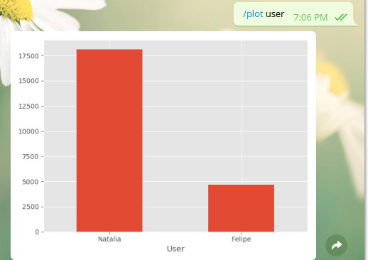
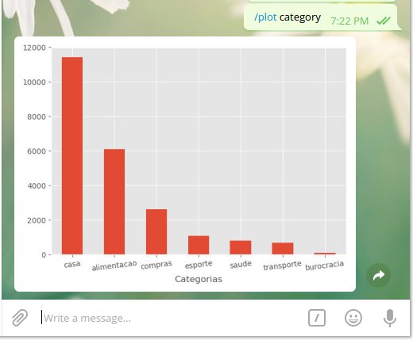
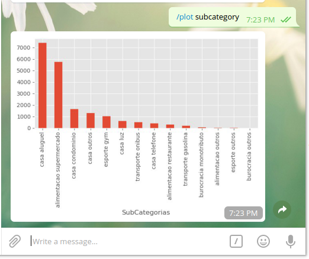
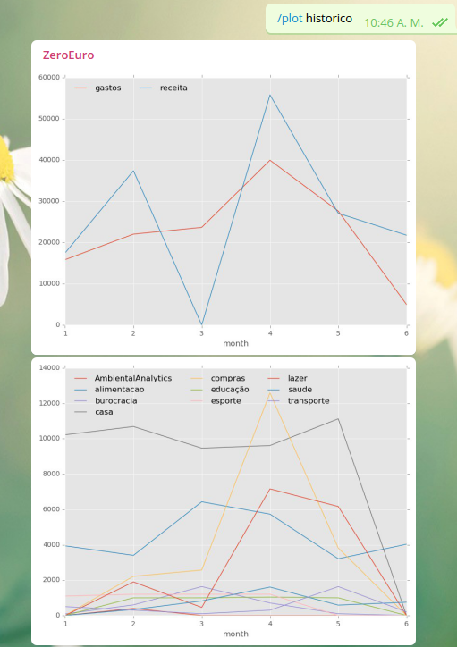

# Zero Euro Bot: Chat Bot para controle financeiro
This project aims to develop a chatbot to easly save information of expenses and income on Domestic Economy, althought it can be used in different approaches;

## About Domestic Economy chatbot:  
  
:heavy_check_mark: You can register your **expenses** (see `/expenses` comand), informing a category and a subcategory (see `/category` & `/subcategory` comands);  
:heavy_check_mark: You can **add new cetegory & subcategory** (see `/add` comand);  
:heavy_check_mark: You can register your **incomes** (see `/income` comand);  
:heavy_check_mark: You can retrieve a **month summary** of your expenses (see `/summary` comand);  
:heavy_check_mark: You can register a **month summary in a graphical way** of your expenses (see `/plot` comand);  
:heavy_check_mark: You can **send sql query** by message (see `/sql` comand);  
:heavy_check_mark: You can **backup your database** (see `/backup` comand);  
:heavy_check_mark: you can use it on a group chat with people yout share your expenses and incomes:couple:; :warning: This is already integrated in `master` branch;  
:heavy_check_mark: you can Have this chatbot deploy in [pythonanywherer](www.pythonanywhere.com) with a **flask** webhook;  
:heavy_check_mark: you can Have a **timeseries** graphs of all your expenses and incomes using[see chatbot-functions](#chatbot-functions);  

## Few things I'm planning to improve later:
- [ ] Improve UX/UI by using menus;  
- [ ] Implement comando by voice by using [Google API](https://aiyprojects.withgoogle.com/voice/#makers-guide-1-2--python-api-reference)  

### Setting up a virtualenv
```
sudo apt-get install python3-pip python3-dev python-virtualenv python3-pandas python3-matplotlib # for Python 3.n
virtualenv ZeroEuroBot -p python3 
source ZeroEuroBot/bin/activate
easy_install -U pip
pip install requests
```

### About files and codes:  
  
* **setup.py**: will create the database, tables and insert default values. 
:warning: Take a look on it if you plan to adequate both category and subcategories to your reality;  
* **dbZeroEuro.py**: has all the functions related to the database: insert & retrieve data;  
* **economybot.py**: is the bot it self. Mannage the text sent to bot and call the according functions;  
* **Bot_run.sh**: a bash script to keep bot running even after it breaks;
* **API.py**: You must create this file where you should put the **bot key**, **user-email** & **email password**;  
 * **Key**: is needed to use the bot; Be careful to keep it save;  
 * **user-email** & **email password**: will be used on `/backup` function (see `/backup`) to send the database backup by e-mail;  
This file should be like:  
```
API = '12312312ADAsxlclncxca'
email = 'your_email@host.com'
password = 'your_password'
```  

### chatbot Functions
* `/start` will greeting the user, check if user is already registered in users table. If not, it will be registered in `users` table;  
  

* `/category` will retrieve all categories already registered in the `category` table;  
e.g.: `/category`  
  

* `/subcategory [category]` will show the subcategories related to a especific `category`;  
e.g.: `/subcategory casa`  
  

* `/income [value]` will save the value assed as a income in the database.  
:warning: Use `.` as decimal!.  
e.g.: `/income 1999.99`  
  

* `/expenses [value] [category] [subcategory]` will save the `value` with `category` and `subcategory` assigned in the database;  
:warning: Use `.` as decimal!.  
e.g.: `/expenses 19.99 casa luz`  
  

* `/summary [param] [paramII] {month} {year}` will return the summary of data saved on database grouping by `param`. If a second param is passed (`paramII`) the summary will be for `category` and `subcategory`. Also you can **optionally** specify a month and year. Otherwise, the summary shown will be of the current month and year;  
e.g.: `/summary category subcategory 01 2018`  
  
  
  

* `/plot [param] [paramII] {month} {year}` will return a graphical (:bar_chart:) summary of data saved on database groupping by `param`.  
e.g.: `/plot category 01 2018`  
  
  
  
  

* `/backup` will create and save a database backup in `backup` folder. Also the backup file will be sent by e-mail (:warning: see API.py).  
e.g.: `/backup`  

* `/add [param] [paramII]` will create and new category or subcategory. When the command `/add` is sent with param, only, the function will check if `param` already exists as category. Otherwise, will be inserted in category table. If `/add` is sent with both `[param]` and `[paramII]`, the `paramII` will be save as subcategory with relation to `param` category.
:warning: If intending to create a new category and subcategory, first create the category (eg.: `/add newCategory`) to later save the new subcategory related to the category previusly created (e.g.: `/add newCategory newSubCategory`).  


* `/sql` send a sql query and the results sent by message.  
:warning: commands like ALTER TABLE or DROP TABLE won't be acceted. This can be changed on economybot.py.  
e.g.: `/sql select * from view_general limit 3`  

### Report

#### Useful Links  
Some links that was useful to develop this project and study python:
* [Python para impacientes](http://python-para-impacientes.blogspot.com.ar)
* [Python Anywhere](https://www.pythonanywhere.com)
* [SQLite3 Documentation](https://sqlite.org/docs.html)
* [SQLite3 Tutorials](http://www.sqlitetutorial.net/)
* [Building a telegram bot](https://www.codementor.io/garethdwyer/building-a-telegram-bot-using-python-part-1-goi5fncay)
* [Matplotlib](https://stackoverflow.com/questions/32244019/how-to-rotate-x-axis-tick-labels-in-pandas-barplot)
* [cookbook-plotting](https://pandas.pydata.org/pandas-docs/stable/cookbook.html#cookbook-plotting)
* [Pandas visualization](https://pandas.pydata.org/pandas-docs/stable/visualization.html#visualization-barplot)
